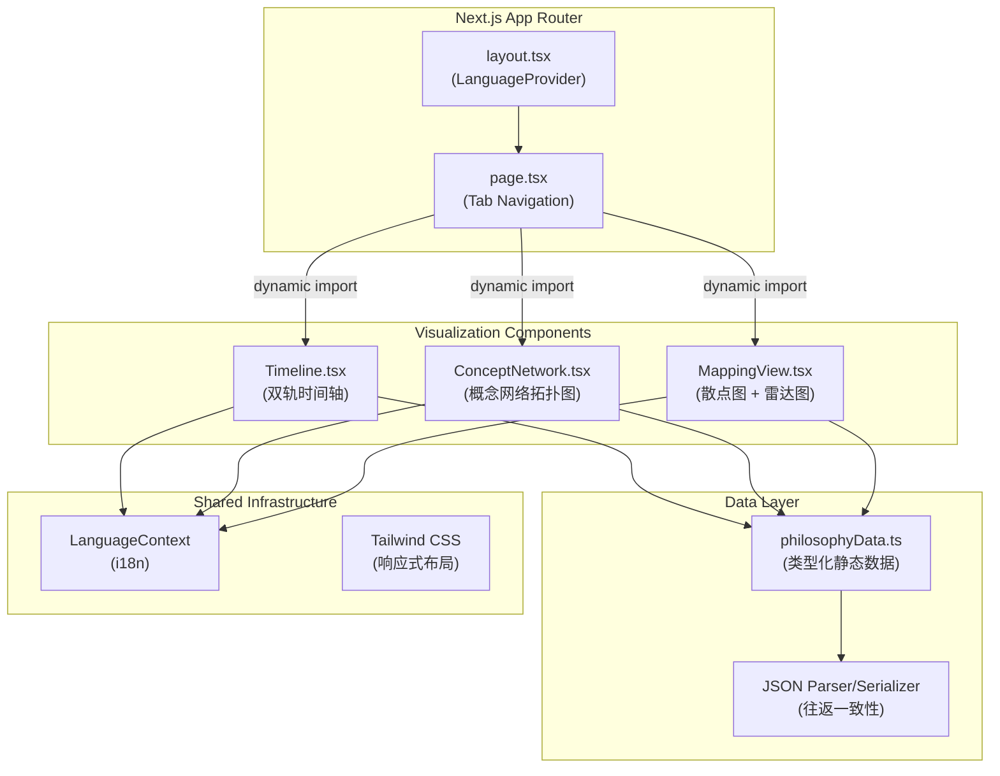
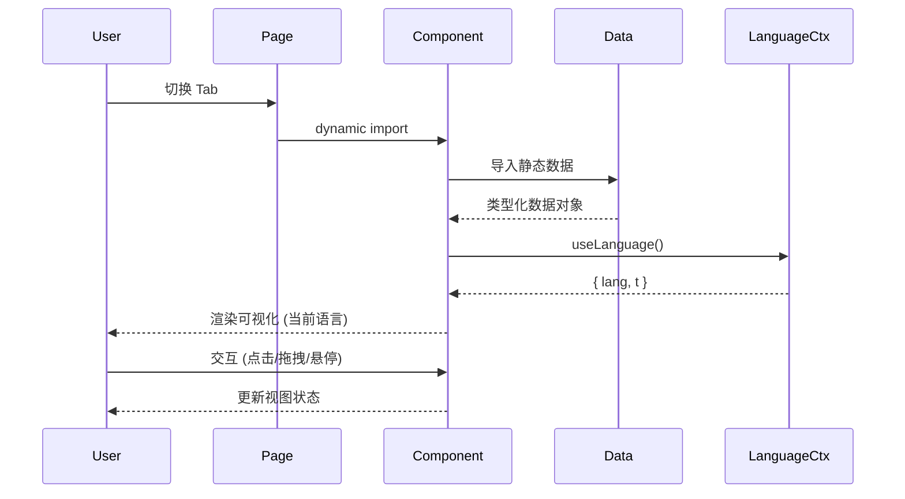
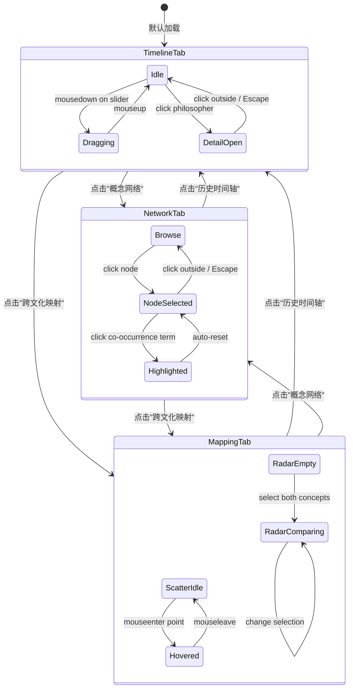
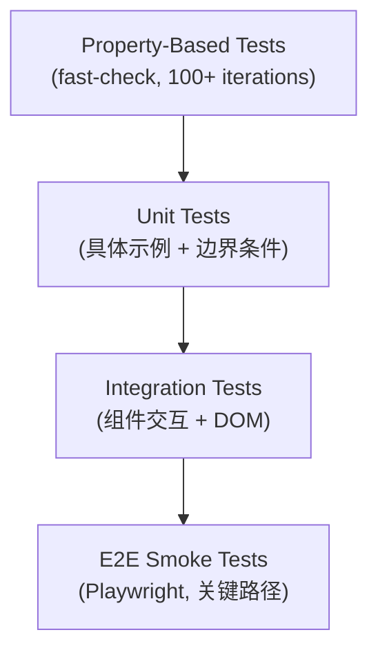

# 设计文档：中西方哲学概念演变与跨文化映射可视化平台

## Overview

本设计文档描述一个数字人文可视化平台的技术架构，该平台用于展示中西方哲学核心概念的历史演变轨迹及跨文化语义映射关系。平台采用 Next.js 14 App Router 架构，结合 D3.js 和 ECharts 实现交互式可视化，以静态 JSON 数据驱动所有展示内容。

### 设计目标

1. **学术严谨性**：准确呈现概念演变的历史时序，跨文化对照附带学理依据
2. **交互直观性**：通过力导向图、时间轴滑块、散点图和雷达图提供多维探索
3. **双语无缝切换**：中英文模式完全独立，切换时所有可视化文本同步更新
4. **性能优先**：代码分割、懒加载，首屏 3 秒内完成渲染
5. **无障碍合规**：WCAG 2.1 AA 标准，键盘导航、ARIA 标签、对比度达标

### 关键设计决策

| 决策 | 选择 | 理由 |
|------|------|------|
| 可视化库 | D3.js (散点图/概念网络) + ECharts (雷达图/时间轴) | D3 提供底层控制适合自定义图形，ECharts 提供开箱即用的常规图表 |
| 数据策略 | 静态 TypeScript/JSON 文件 | 无后端依赖，学术数据变动频率低，构建时类型安全 |
| 状态管理 | React Context (语言) + 组件局部状态 | 全局状态仅语言一项，其余可视化状态局部管理足够 |
| 路由策略 | 单页 Tab 切换（非多路由） | 三个功能模块紧密关联，tab 切换体验优于路由跳转 |
| 响应式策略 | Tailwind CSS 断点 + D3/ECharts ResizeObserver | CSS 管理布局，JS 管理画布尺寸 |

---

## Architecture

### 系统架构图



### 渲染策略

- **SSR 禁用**：所有可视化组件标记 `ssr: false`，因 D3/ECharts 依赖 DOM
- **代码分割**：通过 `next/dynamic` 实现组件级代码分割，仅加载当前激活的 Tab 对应模块
- **懒加载**：JSON 数据随组件加载，不在首屏全部引入

### 数据流



---

## Components and Interfaces

### 组件层次结构

```
src/
├── app/
│   ├── layout.tsx          # LanguageProvider 包裹
│   ├── page.tsx            # Tab 导航 + 动态加载
│   └── globals.css         # 全局样式 + Tailwind
├── components/
│   ├── LanguageContext.tsx  # 语言上下文
│   └── visualizations/
│       ├── Timeline.tsx     # 双轨时间轴
│       ├── ConceptNetwork.tsx # 概念网络拓扑图
│       └── MappingView.tsx  # 散点图 + 雷达图
└── data/
    └── philosophyData.ts    # 静态数据 + 工具函数
```

### 组件接口定义

#### Timeline

```typescript
interface TimelineProps {
  className?: string
}

// 内部状态
interface TimelineState {
  selectedYear: number | null       // 滑块当前年份
  selectedPhilosopher: Philosopher | null  // 详情面板目标
  isDragging: boolean               // 拖拽状态
}

// 子组件
interface PhilosopherNodeProps {
  philosopher: Philosopher
  isTop: boolean        // true=西方(上方), false=中国(下方)
  lineHeight: number    // 连接线高度 (避免重叠)
}
```

#### ConceptNetwork

```typescript
interface NetworkNode extends d3.SimulationNodeDatum {
  id: string
  term: { zh: string; en: string }
  tradition: 'western' | 'chinese'
  definition: { zh: string; en: string }
  source: { work: { zh: string; en: string }; chapter?: { zh: string; en: string } }
  coOccurrence: { zh: string; en: string }[]
  weight: number
}

interface NetworkLink extends d3.SimulationLinkDatum<NetworkNode> {
  relation: 'evolution' | 'influence' | 'contrast'
}

// D3 力模拟配置
interface ForceConfig {
  linkDistance: 130
  chargeStrength: -500
  collisionRadius: 45
  centerStrength: 0.02
}
```

#### MappingView (散点图 + 雷达图)

```typescript
// 散点图状态
interface ScatterPlotState {
  hoveredPoint: ConceptProjection | null
  isLoading: boolean
  dimensions: { width: number; height: number }
}

// 雷达图 Props
interface RadarChartProps {
  westernId: string   // 选中的西方概念 ID
  chineseId: string   // 选中的中国概念 ID
}
```

#### LanguageContext

```typescript
type Lang = 'zh' | 'en'

interface LanguageContextType {
  lang: Lang
  toggleLang: () => void
  t: (zh: string, en: string) => string
}
```

### 组件交互流程



---

## Data Models

### 核心数据类型

```typescript
// 哲学家
export interface Philosopher {
  id: string
  name: { zh: string; en: string }
  birth: number        // 负数 = 公元前
  death: number
  era: { zh: string; en: string }
  avatar: string
  tradition: 'western' | 'chinese'
  summary: { zh: string; en: string }
  works: { zh: string; en: string }[]
}

// 核心文本
export interface CoreText {
  philosopherId: string
  title: { zh: string; en: string }
  year: number
  chapter?: { zh: string; en: string }
  excerpt: { zh: string; en: string }
}

// 概念节点
export interface ConceptNode {
  id: string
  term: { zh: string; en: string }
  tradition: 'western' | 'chinese'
  definition: { zh: string; en: string }
  source: { work: { zh: string; en: string }; chapter?: { zh: string; en: string } }
  coOccurrence: { zh: string; en: string }[]
  weight: number      // 0-1, 影响节点大小
}

// 概念演变边
export interface ConceptEdge {
  source: string      // 概念 ID
  target: string      // 概念 ID
  relation: 'evolution' | 'influence' | 'contrast'
}

// 散点图投影坐标
export interface ConceptProjection {
  conceptId: string
  term: { zh: string; en: string }
  tradition: 'western' | 'chinese'
  x: number           // 0-1, 抽象↔具体
  y: number           // 0-1, 实践↔形而上
}

// 雷达图维度评分
export interface RadarDimension {
  conceptId: string
  ontology: number      // 本体论 0-100
  epistemology: number  // 认识论 0-100
  ethics: number        // 伦理学 0-100
  aesthetics: number    // 美学 0-100
  logic: number         // 逻辑学 0-100
}
```

### 概念演变网络拓扑

**西方概念演变链：**
```
Being → Form → Substance → Cogito → Subject → Noumenon → Language
                                        └→ Will
```

**中国概念演变链（按历史时序）：**
```
先秦道家: 道 → 无
先秦儒家: 仁 → 天人感应
宋明汇合: 道 → 理, 仁 → 理 (朱熹综合儒道)
宋明展开: 理 → 气, 理 → 心 → 良知
```

**跨文化对照边（虚线双向）：**

| 西方 | 中国 | 学理依据 |
|------|------|----------|
| Being | 道 | 最高本体论范畴 |
| Form | 理 | 超越个体的普遍原则 |
| Substance | 气 | 构成万物的基底 |
| Cogito | 心 | 主体性确立 |
| Subject | 心 | 主体性问题的不同回答 |
| Noumenon | 无 | 认识边界——不可知者/不可名者 |
| Noumenon | 道 | 超越现象的终极实在 |
| Will | 良知 | 行动驱力（争议性对照） |

### JSON 数据解析与序列化

```typescript
// 解析器接口
interface PhilosophyDataParser {
  parsePhilosophers(json: string): Philosopher[]
  parseConceptNodes(json: string): ConceptNode[]
  parseConceptEdges(json: string): ConceptEdge[]
  parseProjections(json: string): ConceptProjection[]
  parseRadarDimensions(json: string): RadarDimension[]
}

// 格式化器接口
interface PhilosophyDataSerializer {
  serializePhilosophers(data: Philosopher[]): string
  serializeConceptNodes(data: ConceptNode[]): string
  serializeConceptEdges(data: ConceptEdge[]): string
  serializeProjections(data: ConceptProjection[]): string
  serializeRadarDimensions(data: RadarDimension[]): string
}

// 校验器接口
interface DataValidator {
  validatePhilosopher(obj: unknown): obj is Philosopher
  validateConceptNode(obj: unknown): obj is ConceptNode
  validateConceptEdge(obj: unknown): obj is ConceptEdge
  validateProjection(obj: unknown): obj is ConceptProjection
  validateRadarDimension(obj: unknown): obj is RadarDimension
}
```

### 数据辅助函数

```typescript
// 已存在于 philosophyData.ts
export function getCoreTextsByPhilosopher(id: string): CoreText[]
export function getConceptById(id: string): ConceptNode | undefined
export function getConceptsByTradition(tradition: 'western' | 'chinese'): ConceptNode[]

// 新增：散点图最近邻计算
export function getNearestNeighbor(point: ConceptProjection): {
  nearest: ConceptProjection | null
  distance: number
}

// 新增：数据校验
export function validateDataIntegrity(data: {
  philosophers: unknown[]
  conceptNodes: unknown[]
  conceptEdges: unknown[]
  projections: unknown[]
  radarDimensions: unknown[]
}): { valid: boolean; errors: string[] }
```

---


## Correctness Properties

*A property is a characteristic or behavior that should hold true across all valid executions of a system—essentially, a formal statement about what the system should do. Properties serve as the bridge between human-readable specifications and machine-verifiable correctness guarantees.*

### Property 1: Chronological ordering preservation

*For any* list of philosophers belonging to the same tradition (western or chinese), the rendered timeline order SHALL preserve chronological sort by birth year (earlier birth → left position).

**Validates: Requirements 1.2, 1.3**

### Property 2: Philosopher node content completeness

*For any* philosopher data object, the rendered philosopher node SHALL display both the name (in the current language) and the era year range.

**Validates: Requirements 1.4**

### Property 3: Year-based philosopher filtering

*For any* selected year value within the timeline range, the set of highlighted philosopher nodes SHALL equal exactly the set of philosophers whose active period (birth to death, with tolerance) overlaps with that year.

**Validates: Requirements 2.1**

### Property 4: Concept detail panel completeness

*For any* concept node data object, the rendered detail panel SHALL contain: the concept definition text, the source reference (work name and chapter), and the co-occurrence vocabulary list.

**Validates: Requirements 4.2**

### Property 5: Tradition-based color assignment

*For any* visual element representing a philosophical entity (concept node, scatter point, philosopher node), its color SHALL be determined by its tradition field: indigo (#2B4C7E) for western tradition, vermillion (#C53030) for chinese tradition.

**Validates: Requirements 3.3, 5.2**

### Property 6: Edge visual style by relation type

*For any* concept edge in the network graph, its visual style SHALL be determined by its relation type: evolution edges use solid lines with arrowhead markers, contrast edges use dashed lines without arrowheads.

**Validates: Requirements 3.4**

### Property 7: Scatter plot hover tooltip completeness

*For any* concept projection point in the scatter plot, hovering SHALL display: the concept term (in current language), its tradition label, and the vector distance to its nearest neighbor.

**Validates: Requirements 5.3**

### Property 8: Radar chart dimensional accuracy

*For any* valid pair of concept IDs (one western, one chinese) that have radar dimension data, the rendered radar chart SHALL plot polygon vertices at positions corresponding to their respective ontology, epistemology, ethics, aesthetics, and logic scores.

**Validates: Requirements 6.2, 6.3**

### Property 9: Data validation correctness

*For any* object, the data validator SHALL return true if and only if the object contains all required fields with correct types as defined by the corresponding TypeScript interface (Philosopher, ConceptNode, ConceptEdge, ConceptProjection, RadarDimension).

**Validates: Requirements 7.5**

### Property 10: JSON serialization round-trip consistency

*For any* valid typed data object (Philosopher, ConceptNode, ConceptEdge, ConceptProjection, or RadarDimension), serializing it to JSON and then parsing the result back SHALL produce an object that is deeply equal to the original.

**Validates: Requirements 8.3**

### Property 11: Unknown field preservation during parsing

*For any* valid JSON object that contains both recognized fields and additional unrecognized fields, parsing it SHALL produce an output that retains all unrecognized fields with their original values.

**Validates: Requirements 8.4**

### Property 12: Color contrast compliance

*For any* text-color and background-color pair used in the platform's visual design, the computed WCAG contrast ratio SHALL be no less than 4.5:1.

**Validates: Requirements 11.3**

### Property 13: Language function correctness

*For any* bilingual text pair (zh, en) and current language state, the `t(zh, en)` function SHALL return exactly the string matching the current language, and never both strings simultaneously.

**Validates: Requirements 12.2, 12.3**

### Property 14: D3 chart text language synchronization

*For any* text label rendered by D3.js in the concept network or scatter plot, after a language toggle event, the text content SHALL update to reflect the new language within the same render cycle.

**Validates: Requirements 12.5**

---

## Error Handling

### 数据加载错误

| 错误场景 | 处理策略 | 用户提示 |
|----------|----------|----------|
| JSON 文件不存在或网络失败 | 捕获 import/fetch 错误 | 显示文件名 + "请检查文件是否存在于 data/ 目录" |
| JSON 格式不合法 | 捕获 SyntaxError | 显示 "数据格式错误" + 具体解析位置 |
| 数据结构校验失败 | 校验器返回错误列表 | 显示缺失的必填字段名 |
| 概念 ID 引用不存在的节点 | 边渲染时跳过无效引用 | 控制台警告，不影响其他正常边的渲染 |

### 可视化渲染错误

| 错误场景 | 处理策略 |
|----------|----------|
| D3 SVG 容器尺寸为零 | 使用 ResizeObserver 监听，尺寸有效后再初始化 |
| 力模拟节点坐标为 NaN | 检测 NaN 并重置为中心点 |
| ECharts 实例未销毁导致内存泄漏 | useEffect cleanup 中调用 dispose() |
| 窗口 resize 时图表抖动 | 添加 debounce（200ms）再重算尺寸 |

### 交互错误

| 错误场景 | 处理策略 |
|----------|----------|
| 点击已被删除的 DOM 节点 | D3 事件绑定检查目标是否存在 |
| 并发语言切换导致渲染不一致 | useCallback 保证 t() 稳定引用，语言状态为原子切换 |
| 移动端触摸与点击事件冲突 | 使用 pointer events 统一处理 |

### 错误边界

```typescript
// 可视化组件包裹 ErrorBoundary
interface ErrorFallbackProps {
  error: Error
  componentName: string
  onRetry: () => void
}

// 每个可视化 Tab 独立 ErrorBoundary，一个组件崩溃不影响其他 Tab
```

---

## Testing Strategy

### 测试分层



### Property-Based Testing (PBT)

**库选择**: [fast-check](https://github.com/dubzzz/fast-check) — TypeScript 原生支持，与 Jest/Vitest 集成良好

**配置要求**:
- 每个属性测试最少 100 次迭代
- 每个测试用注释标注对应的设计文档属性编号
- Tag 格式: `Feature: philosophy-cross-cultural-mapping, Property {N}: {description}`

**覆盖的属性**:

| Property | 测试策略 | Generator |
|----------|----------|-----------|
| P1: Chronological ordering | 生成随机 Philosopher[] 列表，验证排序后位置单调递增 | `fc.array(fc.record({birth: fc.integer(-600, 2000), ...}))` |
| P3: Year filtering | 生成随机年份，计算预期高亮集合，比对实际 | `fc.integer(-600, 2000)` |
| P5: Color assignment | 生成随机 tradition 值，验证颜色映射 | `fc.constantFrom('western', 'chinese')` |
| P6: Edge style | 生成随机 relation 值，验证样式输出 | `fc.constantFrom('evolution', 'contrast')` |
| P9: Validation | 生成随机对象（含有效/无效变体），验证校验器判断 | `fc.record(...)` with optional field deletion |
| P10: Round-trip | 生成随机类型化数据对象，序列化再解析后 deepEqual | `fc.record(philosopherArb)` 等 |
| P11: Unknown fields | 生成带额外字段的 JSON，解析后验证保留 | `fc.record({...known, ...fc.dictionary(...)})` |
| P12: Contrast ratio | 枚举所有颜色对，验证 WCAG 比率 | Color pair exhaustive list |
| P13: Language function | 生成随机双语字符串对 + 语言状态，验证输出 | `fc.tuple(fc.string(), fc.string(), fc.constantFrom('zh','en'))` |

### Unit Tests (Example-Based)

**覆盖范围**:
- 初始渲染结构（1.1, 3.1, 3.2, 5.1, 6.1）
- 详情面板打开/关闭（4.1, 4.3, 4.4）
- 数据加载与错误状态（7.1-7.4, 5.4）
- 语言默认状态（12.1, 12.4）
- 响应式布局断点（9.1-9.3）

### Integration Tests

**覆盖范围**:
- 时间轴拖拽响应延迟（2.4）
- 雷达图更新延迟（6.4）
- 窗口 resize 图表重算（9.4）
- 概念网络缩放/平移（3.5）
- D3 图表语言切换联动（12.5）

### E2E Smoke Tests

**关键路径**:
1. 页面加载 → 时间轴可见 → 切换 Tab → 概念网络加载 → 点击节点 → 详情面板
2. 散点图加载 → 悬停提示 → 选择概念 → 雷达图渲染
3. 语言切换 → 所有文本更新
4. 移动端视口 → 布局正确

### 性能基准

| 指标 | 目标 | 测量方式 |
|------|------|----------|
| 首屏渲染 (LCP) | < 3s | Lighthouse CI |
| 时间轴拖拽响应 | < 100ms | Performance.measure() |
| 雷达图更新 | < 300ms | requestAnimationFrame 计时 |
| 代码分割效果 | 主 bundle < 200KB | webpack-bundle-analyzer |

---
